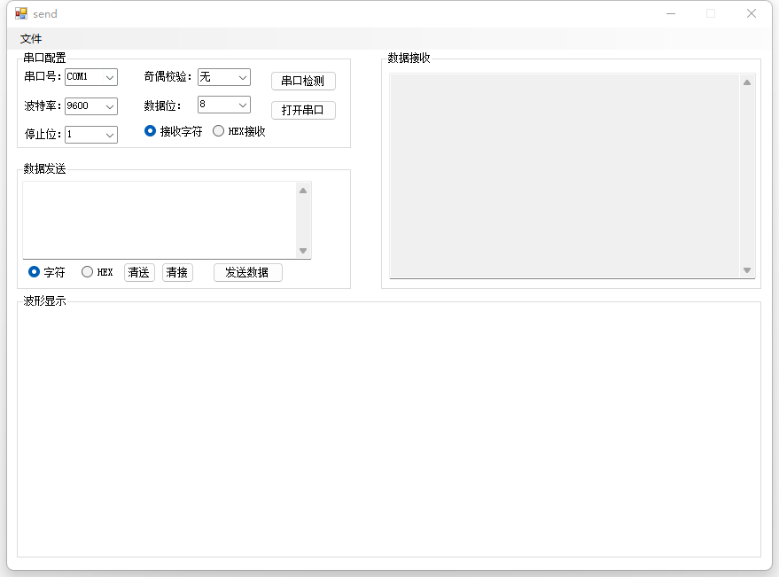

# [上位机](https://baike.baidu.com/item/上位机)

**上位机**是指可以直接发出操控命令的计算机，一般是PC/host computer/master computer/upper computer,屏幕上显示各种信号变化（液压，[水位](https://baike.baidu.com/item/水位/21295)，温度等）。[下位机](https://baike.baidu.com/item/下位机/9624953)是直接控制设备获取设备状况的[计算机](https://baike.baidu.com/item/计算机/140338)，一般是PLC/[单片机](https://baike.baidu.com/item/单片机/102396)single chip microcomputer/slave computer/lower computer之类的。上位机发出的命令首先给下位机，下位机再根据此命令解释成相应[时序信号](https://baike.baidu.com/item/时序信号/4419171)直接控制相应设备。下位机（单片机）与 上位机之间要进行数据通信的两种方式都是基于**串口**的


# 串口通信

> 串行接口（串口）是一种可以将接受来自CPU的并行数据字符转换为连续的串行数据流发送出去，同时可将接受的串行数据流转换为并行的数据字符供给CPU的器件。一般完成这种功能的电路，我们称为串行接口电路。
>
> 串口通信（Serial Communications）的概念非常简单，串口按位（bit）发送和接收字节。尽管比按字节（byte）的并行通信慢，但是串口可以在使用一根线发送数据的同时用另一根线接收数据。串口通信最重要的参数是波特率、数据位、停止位和奇偶校验。对于两个进行通信的端口，这些参数必须匹配。

1. 波特率：指的是信号被调制以后在单位时间内的变化，即单位时间内载波参数变化的次数，这是一个衡量符号传输速率的参数。

   > 如每秒钟传送960个字符，而每个字符格式包含10位（1个起始位，1个停止位，8个数据位），这时的波特率为960Bd，比特率为10位*960个/秒=9600bps。

2. 数据位：当计算机发送一个信息包，实际的数据往往不会是8位的，标准的值是6、7和8位。标准的ASCII码是0～127（7位），扩展的ASCII码是0～255（8位）。

3. 停止位：表示单个数据包的最后几位，也就是用于该数据包结束的标志，常用的值有1，1.5，2位

4. 奇偶校验：一种检验方式


## C#串口通信：SerialPort类

参考官方文档：[SerialPort 类 (System.IO.Ports) | Microsoft Docs](https://docs.microsoft.com/zh-cn/dotnet/api/system.io.ports.serialport?redirectedfrom=MSDN#mainBody)

常用的字段，方法，与事件：

对于SerialPort类，如果要创建实例，其参数最常用设置如下：

| 名称     | 类型                                                         | 说明                                                         |
| -------- | ------------------------------------------------------------ | ------------------------------------------------------------ |
| PortName | [String](https://docs.microsoft.com/zh-cn/dotnet/api/system.string) | 通信端口，（例如 COM1）                                      |
| BaudRate | [Int32](https://docs.microsoft.com/zh-cn/dotnet/api/system.int32) | 串行波特率                                                   |
| DataBits | [Int32](https://docs.microsoft.com/zh-cn/dotnet/api/system.int32) | 数据位值，每个字节的标准数据位长度                           |
| Parity   | [Parity](https://docs.microsoft.com/zh-cn/dotnet/api/system.io.ports.parity) | [Parity](https://docs.microsoft.com/zh-cn/dotnet/api/system.io.ports.serialport.parity#system-io-ports-serialport-parity) 值之一，表奇偶校验检查协议 |
| StopBits | [StopBits](https://docs.microsoft.com/zh-cn/dotnet/api/system.io.ports.stopbits) | [StopBits](https://docs.microsoft.com/zh-cn/dotnet/api/system.io.ports.serialport.stopbits#system-io-ports-serialport-stopbits) 值之一，表每个字节的标准停止位数 |

常用方法：()

| 名称                                                         | 说明                                                         |
| ------------------------------------------------------------ | ------------------------------------------------------------ |
| [Close](https://docs.microsoft.com/zh-cn/dotnet/api/system.io.ports.serialport.close) | 关闭端口连接，将 [IsOpen](https://docs.microsoft.com/zh-cn/dotnet/api/system.io.ports.serialport.isopen#system-io-ports-serialport-isopen) 属性设置为 `false`，并释放内部 [Stream](https://docs.microsoft.com/zh-cn/dotnet/api/system.io.stream) 对象。 |
| [GetPortNames](https://docs.microsoft.com/zh-cn/dotnet/api/system.io.ports.serialport.getportnames) | 获取当前计算机的串行端口名称数组                             |
| [Open](https://docs.microsoft.com/zh-cn/dotnet/api/system.io.ports.serialport.open) | 打开一个新的串行端口连接                                     |
| [Read](https://docs.microsoft.com/zh-cn/dotnet/api/system.io.ports.serialport.read) | 从SerialPort输入缓冲区中读取                                 |
| [Write](https://docs.microsoft.com/zh-cn/dotnet/api/system.io.ports.serialport.write) | 将数据写入串行端口输出缓冲区                                 |

常用事件:

| 名称                                                         | 说明                                                         |
| ------------------------------------------------------------ | ------------------------------------------------------------ |
| [DataReceived](https://docs.microsoft.com/zh-cn/dotnet/api/system.io.ports.serialport.datareceived) | 指示已通过由 [SerialPort](https://docs.microsoft.com/zh-cn/dotnet/api/system.io.ports.serialport) 对象表示的端口接收了数据。 |


## 列出所有的串口

封装一个串口号检测的方法，并显示到串口号（组件名叫cbxCOMPort）中：

```c#
string[] portNamesArray = SerialPort.GetPortNames();//获取所有可用串口名字
cbxCOMPort.Items.Clear();       //清除当前串口号中的所有串口名称
foreach (string port in portNamesArray)
{
    cbxCOMPort.Items.Add(port);
}
```


## C#串口通信：读写数据

### 写数据：[SerialPort.Write](https://docs.microsoft.com/zh-cn/dotnet/api/system.io.ports.serialport.write)，[SerialPort.WriteLine](https://docs.microsoft.com/zh-cn/dotnet/api/system.io.ports.serialport.writeline)

| 函数                                              | 说明                                                         |
| ------------------------------------------------- | ------------------------------------------------------------ |
| void Write(string text);                          | 将指定的字符串写入串行端口。                                 |
| void Write(byte[] buffer, int offset, int count); | 使用缓冲区中的数据将指定数量的字节写入串行端口。             |
| void Write(char[] buffer, int offset, int count); | 使用缓冲区中的数据将指定数量的字符写入串行端口。             |
| void WriteLine (string text);                     | 将指定的字符串和 [NewLine](https://docs.microsoft.com/zh-cn/dotnet/api/system.io.ports.serialport.newline#system-io-ports-serialport-newline) 值写入输出缓冲区。 |

使用细节：

1. Write函数是同步的。在数据发送完之前，Write函数是不会返回的。比如：波特率1200，发送1024个字节大概要耗时9秒。如果这段代码在主线程里，那么这9秒内整个程序将处于假死状态，即主函数无法响应用户的键盘、鼠标输入；

2. WriteTimeout属性用于控制Write函数的最长耗时。它的默认值为System.IO.Ports.SerialPort.InfiniteTimeout，也就是-1。其含义为：Write函数不将所有数据写完绝不返回。可以修改此属性：

   ```c#
   port.WriteTimeout = 5000//Write 函数最多耗时 5秒
   //Write写数据时最多耗时5秒，超过这个时间未发的数据将被舍弃，Write函数抛出异常TimeoutException后立即返回。
   ```

   

### 读数据：[SerialPort.Read](https://docs.microsoft.com/zh-cn/dotnet/api/system.io.ports.serialport.read)，[SerialPort.ReadByte](https://docs.microsoft.com/zh-cn/dotnet/api/system.io.ports.serialport.readbyte)，[SerialPort.ReadChar](https://docs.microsoft.com/zh-cn/dotnet/api/system.io.ports.serialport.readchar)，[SerialPort.ReadExisting](https://docs.microsoft.com/zh-cn/dotnet/api/system.io.ports.serialport.readexisting)，[SerialPort.ReadLine](https://docs.microsoft.com/zh-cn/dotnet/api/system.io.ports.serialport.readline)，[SerialPort.ReadTo](https://docs.microsoft.com/zh-cn/dotnet/api/system.io.ports.serialport.readto)

| 函数                                            | 说明                                                         |
| ----------------------------------------------- | ------------------------------------------------------------ |
| int Read(byte[] buffer, int offset, int count); | 从 [SerialPort](https://docs.microsoft.com/zh-cn/dotnet/api/system.io.ports.serialport) 输入缓冲区读取一些字节并将那些字节写入字节数组中指定的偏移量处。 |
| int Read(char[] buffer, int offset, int count); | 从 [SerialPort](https://docs.microsoft.com/zh-cn/dotnet/api/system.io.ports.serialport) 输入缓冲区中读取一些字符，然后将这些字符写入字符数组中指定的偏移量处。 |
| int ReadByte ();                                | 从 [SerialPort](https://docs.microsoft.com/zh-cn/dotnet/api/system.io.ports.serialport) 输入缓冲区中同步读取一个字节。 |
| int ReadChar ();                                | 从 [SerialPort](https://docs.microsoft.com/zh-cn/dotnet/api/system.io.ports.serialport) 输入缓冲区中同步读取一个字符。 |
| string ReadExisting();                          | 在编码的基础上，读取 [SerialPort](https://docs.microsoft.com/zh-cn/dotnet/api/system.io.ports.serialport) 对象的流和输入缓冲区中所有立即可用的字节。 |
| string ReadLine();                              | 一直读取到输入缓冲区中的 [NewLine](https://docs.microsoft.com/zh-cn/dotnet/api/system.io.ports.serialport.newline#system-io-ports-serialport-newline) 值。 |
| string ReadTo(string value);                    | 一直读取到输入缓冲区中的指定 `value` 的字符串。              |

使用细节：

1. Read函数是同步的，在数据读取完之前，该函数是不会返回的。如果这段代码在主线程里，那么整个程序将处于假死状态；

2. eadTimeout属性用于控制Read函数的最长耗时。它的默认值为System.IO.Ports.SerialPort.InfiniteTimeout，也就是-1。其含义为：Read函数未读取到串口数据之前是不会返回的。可以修改此属性：

   ```c#
   port.ReadTimeout = 2000;//read函数最多耗时2秒，超过这个时间未读取到数据，Read函数将抛出异常TimeoutException，然后返回。
   ```


### DataReceived事件：

串口输入缓冲区获得新数据后，会以DataReceived事件通知System.IO.Ports.SerialPort对象，可以在此时读取串口数据。

```c#
port.ReceivedBytesThreshold = 1;//串口输入缓冲区获得新数据后，将检查缓冲区内已有的字节数，大于等于ReceivedBytesThreshold就会触发DataReceived事件.这里设置为1，显然就是一旦获得新数据后，立即触发DataReceived事件。

port.DataReceived += new System.IO.Ports.SerialDataReceivedEventHandler(port_DataReceived);//对于DataReceived事件，用函数port_DataReceived进行处理。
```

```c#
//回调函数port_DataReceived用于响应DataReceived事件，通常在这个函数里读取串口数据。
//参数sender就是事件的发起者（这里就是port）,也就是说：多个串口对象可以共用一个回调函数，通过sender可以区分是哪个串口对象。
//回调函数是被一个多线程调用的，它不在主线程内。所以，不要在这个回调函数里直接访问界面控件。如果一定要用，那么就需要使用Invoke或BeginInvoke来使用
void port_DataReceived(object sender, System.IO.Ports.SerialDataReceivedEventArgs e)
{
    int nRead = port.BytesToRead;
    if (nRead > 0)
    {
        byte[] data = new byte[nRead];
        port.Read(data, 0, nRead);
    }
}
```


### 数据发送不同步问题：

描述：串行通讯的双方，如果有一方反应较慢，另一方不管不顾的不停发送数据，就可能造成数据丢失。为了防止这种情况发生，需要使用流控制。

流控制也叫握手，使用 [Handshake](https://docs.microsoft.com/zh-cn/dotnet/api/system.io.ports.handshake) 中的值获取或设置串行端口数据传输的握手协议。

有四种取值：

| 取值                                           | 说明       |
| ---------------------------------------------- | ---------- |
| System.IO.Ports.Handshake.None                 | 无         |
| System.IO.Ports.Handshake.XOnXOff              | 软件       |
| System.IO.Ports.Handshake.RequestToSend        | 硬件       |
| System.IO.Ports.Handshake.RequestToSendXOnXOff | 硬件和软件 |

(1) 软件流控制（XON/XOFF）

[Handshake](https://docs.microsoft.com/zh-cn/dotnet/api/system.io.ports.serialport.handshake)如果该属性设置为[RequestToSendXOnXOff](https://docs.microsoft.com/zh-cn/dotnet/api/system.io.ports.handshake#system-io-ports-handshake-requesttosendxonxoff)且[CtsHolding](https://docs.microsoft.com/zh-cn/dotnet/api/system.io.ports.serialport.ctsholding)设置为`false`该属性，则不会发送 XOff 字符。 如果 [CtsHolding](https://docs.microsoft.com/zh-cn/dotnet/api/system.io.ports.serialport.ctsholding) 设置为 `true`，则必须在发送 XOff 字符之前发送更多数据。

串口设备A给串口设备B发送数据。B忙不过来时（B的串口输入缓冲区快满了）会给A发送字符XOFF（一般为13H），A将暂停发送数据；B的串口输入缓冲区快空时，会给A发送字符XON（一般为11H），A将继续发送数据。

软件流控制最大的问题在于：通讯双方不能传输字符XON和XOFF。

(2)硬件流控制（RTS/CTS）需要一定的硬件知识，不是很懂


=======================================================================================================================================================================================================================================================================================================================================================================================================================================================================================================================================================================================================================================

开始设计：

# 界面设计

首先对于使用C#而言，可以通过拖拽的方式进行，最主要的设计：

1. (窗体的属性，事件，方法)
2. 控件的排布，
3. 事件的监听，
4. 当监听到某个事件后，需要执行的方法。

对于该上位机的设计，界面如下：



主要是通过拖拽控件，并且设计布局达到上面的效果。


# 波形显示（chart控件的使用）

参考：[C#--图表控件（Chart）_北极星小王子的博客-CSDN博客_c# chart](https://blog.csdn.net/weixin_41835916/article/details/83789061)

[C#之Chart控件系列教程——一（转载）_hellohake的博客-CSDN博客_c# chart控件](https://blog.csdn.net/hellohake/article/details/106613787)

chart控件的五大核心属性：

- Annotations
- ChartAreas
- Legends
- Series
- Titles

其中最为核心的三个属性是ChartAreas、Series、Legends

初始化图像设置封装成函数有:

```c#
private void InitChart()
{
    //定义图表区域
    this.chart1.ChartAreas.Clear();
    ChartArea chartArea1 = new ChartArea("C1");
    this.chart1.ChartAreas.Add(chartArea1);
    //定义存储和显示点的容器
    this.chart1.Series.Clear();
    Series series1 = new Series("S1");
    Series series2 = new Series("S2");
    Series series3 = new Series("S3");
    series1.ChartArea = "C1";
    series2.ChartArea = "C1";
    series3.ChartArea = "C1";
    this.chart1.Series.Add(series1);
    this.chart1.Series.Add(series2);
    this.chart1.Series.Add(series3);
    //设置图表显示样式
    this.chart1.ChartAreas[0].AxisX.ArrowStyle = AxisArrowStyle.Triangle;//设置坐标x轴箭头为三角
    this.chart1.ChartAreas[0].AxisY.ArrowStyle = AxisArrowStyle.Triangle;//设置坐标y轴箭头为三角

    //设置x轴的最大最小值
    //this.chart1.ChartAreas[0].AxisX.Minimum = 0;
    //this.chart1.ChartAreas[0].AxisX.Maximum = 100;
    this.chart1.ChartAreas[0].AxisX.Interval = 100;//x轴刻度间隔大小

    //设置y轴的最大最小值
    this.chart1.ChartAreas[0].AxisY.Minimum = 0;
    this.chart1.ChartAreas[0].AxisY.Maximum = 100;
    this.chart1.ChartAreas[0].AxisY.Interval = 10;//x轴刻度间隔大小

    //设置xy轴的颜色
    this.chart1.ChartAreas[0].AxisX.MajorGrid.LineColor = System.Drawing.Color.Silver;
    this.chart1.ChartAreas[0].AxisY.MajorGrid.LineColor = System.Drawing.Color.Silver;

    //不设置标题
    this.chart1.Titles.Clear();

    //设置图表显示样式
    this.chart1.Series[0].Color = Color.Red;
    this.chart1.Series[1].Color = Color.Blue;
    this.chart1.Series[2].Color = Color.Green;

    //设置线形：
    //SeriesChartType.Spline
    //SeriesChartType.Line
    this.chart1.Series[0].ChartType = SeriesChartType.Line;
    this.chart1.Series[1].ChartType = SeriesChartType.Line;
    this.chart1.Series[2].ChartType = SeriesChartType.Line;

    //开始清空数据
    this.chart1.Series[0].Points.Clear();
    this.chart1.Series[1].Points.Clear();
    this.chart1.Series[2].Points.Clear();

}
```


显示波形

需求:

1. 通过SerialPort接收到数据，然后处理，分别保存到data_display1,data_display2,data_display3中，分别表示三个波形数据
2. 将三个波形数据画到chart中。也就是将数据添加到Series中
3. 实时更新数据


思路：

将传输过来的数据保存到私有变量data_display1,data_display2,data_display3。

通过定时器函数，将私有变量的数据打印成波形。


> 这里有个问题，如果定时器函数一直开着会不会导致设备性能变差???


定时器介绍：

主要属性有：

1. Enabled：如果 [Timer](https://docs.microsoft.com/zh-cn/dotnet/api/system.timers.timer?view=netframework-4.8) 应引发 [Elapsed](https://docs.microsoft.com/zh-cn/dotnet/api/system.timers.timer.elapsed?view=netframework-4.8) 事件，则为 `true`；否则，为 `false`。 默认值为 `false`。
2. Interval：获取或设置引发 [Elapsed](https://docs.microsoft.com/zh-cn/dotnet/api/system.timers.timer.elapsed?view=netframework-4.8) 事件的间隔（以毫秒为单位）

绑定事件：点击进去就行。

> 这里有个疑问，不知道是不是版本问题，在编写代码的时候添加事件是aTimer.Tick += OnTimedEvent;
>
> 但是查官方文档的时候发现是：aTimer.Elapsed += OnTimedEvent;


波形显示函数介绍：

| 函数                                                         | 说明                                                         |
| ------------------------------------------------------------ | ------------------------------------------------------------ |
| [AddXY(Double, Double)](https://docs.microsoft.com/zh-cn/dotnet/api/system.windows.forms.datavisualization.charting.datapointcollection.addxy?view=netframework-4.8#system-windows-forms-datavisualization-charting-datapointcollection-addxy(system-double-system-double)) | 向集合的末尾添加一个具有指定的 X 值和 Y 值的 [DataPoint](https://docs.microsoft.com/zh-cn/dotnet/api/system.windows.forms.datavisualization.charting.datapoint?view=netframework-4.8) 对象。 |
| [Clear()](https://docs.microsoft.com/zh-cn/dotnet/api/system.collections.objectmodel.collection-1.clear?view=netframework-4.8#system-collections-objectmodel-collection-1-clear) | 从 [Collection](https://docs.microsoft.com/zh-cn/dotnet/api/system.collections.objectmodel.collection-1?view=netframework-4.8) 中移除所有元素。(继承自 [Collection](https://docs.microsoft.com/zh-cn/dotnet/api/system.collections.objectmodel.collection-1?view=netframework-4.8)) |

对于data_display1,data_display2,data_display3数据可以采用两种方式：数组类型（全部显示数据），队列类型（显示最后的定长数据）

1. 数组类型，代码

   ```c#
   //创建list
   private List<double> list = new List<double>();
   
   // 使用add()方法添加元素
   list.Add(obj); 
   
   //返回list中存在的元素总数
   list.Count;
   
   //获取list中第i个元素
   data_display1.ElementAt(i);
   data_display1[i]
   ```

   定时器的案例，创建两个定时器，一个定时器用与生成数据，一个定时器用于显示波形。

   > 通过设置两个定时器可以模拟数据传输不同步的时候是否会发生问题。设置两个定时器的Interval属性，看一下波形产生的效果

   ```c#
   //定义的成员变量，用于保存波形数据
   private List<double> data_display1 = new List<double>();
   private List<double> data_display2 = new List<double>();
   private List<double> data_display3 = new List<double>();
   ```

   ```c#
   //定时器1：
   //接收数据到list中，假的数据
   Random r = new Random();
   data_display1.Add(r.NextDouble() * 10);
   data_display2.Add(r.NextDouble() * 20 + 10);
   data_display3.Add(r.NextDouble() * 20 + 40);
   ```

   ```c#
   //定时器2，显示波形数据
   //更新显示波形，先删除之前的数据，然后将目前的数据显示出来
   this.chart1.Series[0].Points.Clear();
   this.chart1.Series[1].Points.Clear();
   this.chart1.Series[2].Points.Clear();
   for (int i = 0; i < data_display1.Count; i++)
   {
       this.chart1.Series[0].Points.AddXY((i + 1), data_display1.ElementAt(i));
       this.chart1.Series[1].Points.AddXY((i + 1), data_display2.ElementAt(i));
       this.chart1.Series[2].Points.AddXY((i + 1), data_display3.ElementAt(i));
   }
   ```

2. 队列类型，代码

   ```c#
   //创建队列queue
   private Queue<double> queue = new Queue<double>(show_len);
   
   //出队操作
   queue.Dequeue();
   
   //入队操作
   queue.Enqueue(obj);
       
   //获取队列中的数据个数data_display1
   queue.Count;
   
   //队列中第i个数据
   queue.ElementAt(i);
   
   ```

   定时器的案例，创建两个定时器，一个定时器用与生成数据，一个定时器用于显示波形。

   ```c#
   //定义的成员变量，用于保存波形数据
   private static int show_len = 100;//定义每次显示数据的长度
   private Queue<double> data_display1 = new Queue<double>(show_len);
   private Queue<double> data_display2 = new Queue<double>(show_len);
   private Queue<double> data_display3 = new Queue<double>(show_len);
   ```

   ```c#
   //定时器1：
   //接收数据到queue中，假的数据
   Random r = new Random();
   int len = r.Next(0, 5);
   
   for (int i = 0;i<len;i++) {
       if (data_display1.Count>show_len) {
           data_display1.Dequeue();
           data_display2.Dequeue();
           data_display3.Dequeue();
       }
       data_display1.Enqueue(r.NextDouble() * 10);
       data_display2.Enqueue(r.NextDouble() * 20+10);
       data_display3.Enqueue(r.NextDouble() * 20+40);
   }
   ```

   ```c#
   //更新显示波形，先删除之前的数据，然后将目前的数据显示出来
   this.chart1.Series[0].Points.Clear();
   this.chart1.Series[1].Points.Clear();
   this.chart1.Series[2].Points.Clear();
   for (int i = 0; i < data_display1.Count; i++)
   {
       this.chart1.Series[0].Points.AddXY((i + 1), data_display1.ElementAt(i));
       this.chart1.Series[1].Points.AddXY((i + 1), data_display2.ElementAt(i));
       this.chart1.Series[2].Points.AddXY((i + 1), data_display3.ElementAt(i));
   }
   ```

   
